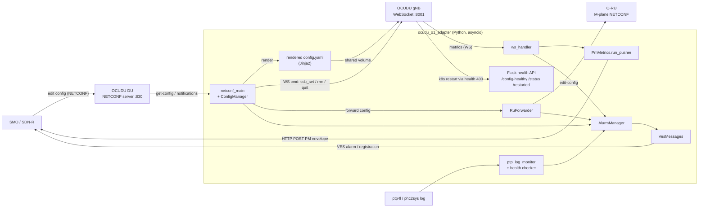
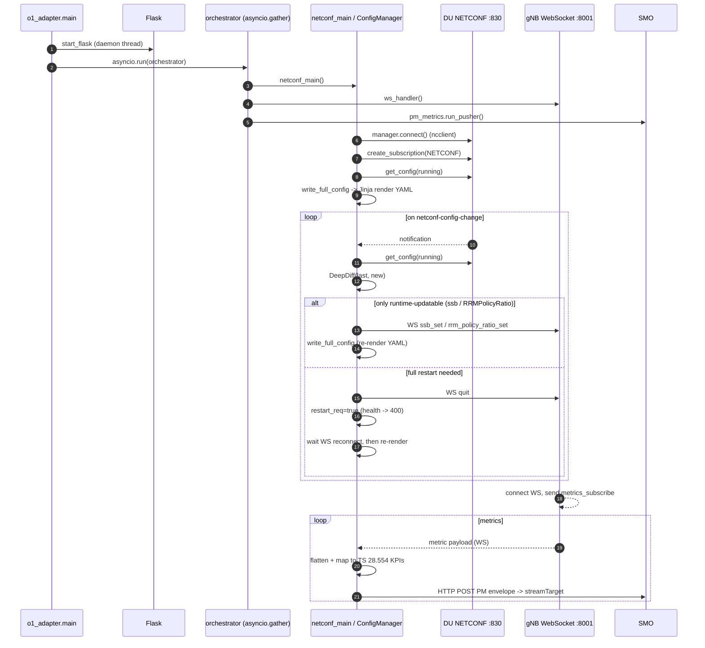
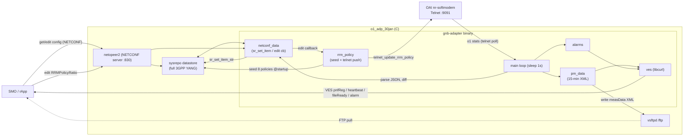
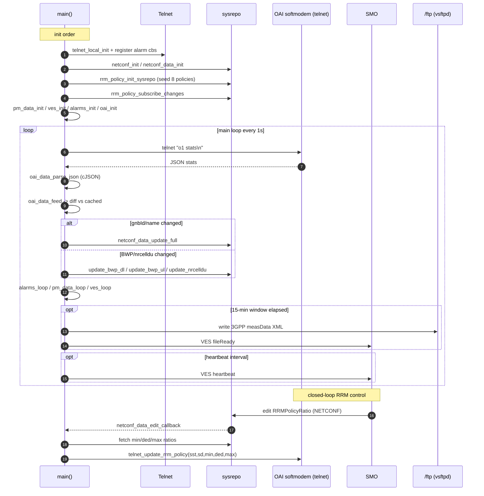
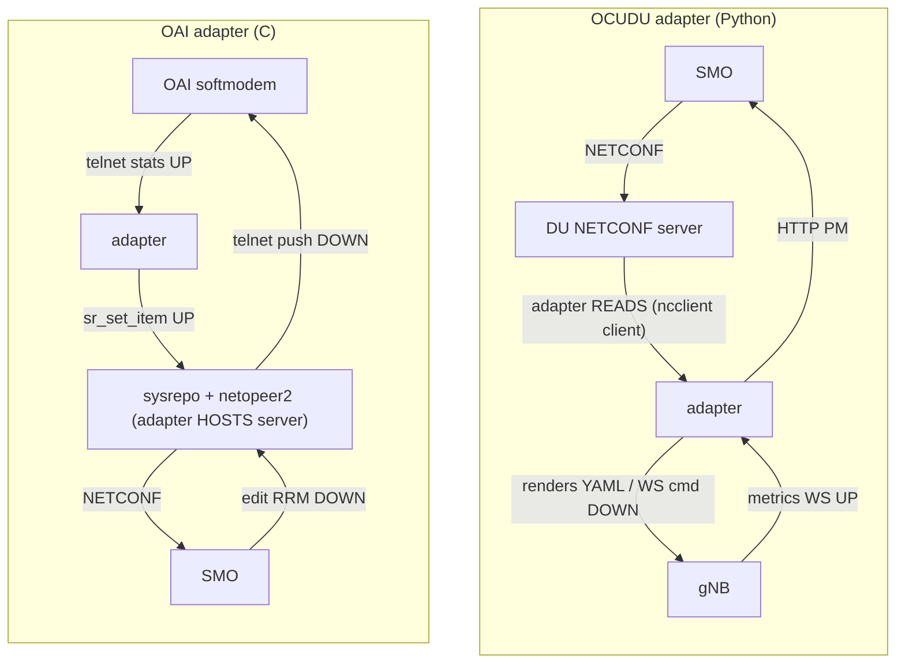

# O1 Adapters — Call Flows

> **Component-interaction sequence diagrams (recommended view):** rendered offline as PNGs in
> [docs/callflow/](docs/callflow/) — they show exactly *how components talk to each other*
> (lifelines + ordered messages + protocols):
> - `docs/callflow/ocudu_interaction.png`
> - `docs/callflow/oai_interaction.png`
>
> The flowcharts below give the same information as component/data-flow graphs.

Two independent O1 adapters compared. They share the O1 *purpose* (CM/FM/PM + VES to an SMO)
but invert the NETCONF role and the direction of config flow.

- **OCUDU adapter** (`ocudu_o1_adapter`, Python, srsRAN/OCUDU) — NETCONF **client**, config flows **down** into the gNB.
- **OAI adapter** (`o1_adp_30jan`, C, OpenAirInterface) — **is** the NETCONF server, RAN state flows **up** into the datastore.

> Tip: open this file in the VSCode Markdown preview (`Ctrl+Shift+V`) to see the diagrams rendered.

---

## 1. OCUDU adapter — component / data-flow view



## 2. OCUDU adapter — startup + runtime sequence



---

## 3. OAI adapter — component / data-flow view



## 4. OAI adapter — startup + runtime sequence



---

## 5. Side-by-side — the key inversion



| Axis | OCUDU (Python) | OAI (C) |
|------|----------------|---------|
| NETCONF role | client (reads DU) | server (hosts netopeer2+sysrepo) |
| Config direction | NETCONF → gNB (down) | RAN → NETCONF (up); SMO edits come down |
| Southbound to RAN | WebSocket + NETCONF | Telnet (`o1 stats`) |
| Concurrency | asyncio tasks | single-thread `sleep(1)` poll loop |
| PM delivery | JSON over HTTP (stream) | 3GPP XML files over FTP + VES fileReady |
| Closed-loop control | WS `ssb_set` / `rrm_policy_ratio_set` | sysrepo edit cb → telnet RRM push |
| Extras | O-RU M-plane, PTP monitor, profiles | full 3GPP YANG, RRM seeding, VES heartbeat |
```
